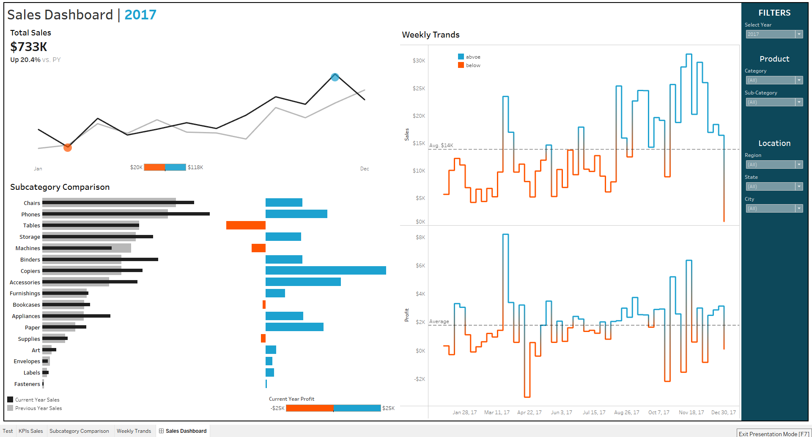

# Sales Performance

## Dashboard Preview

🔗[View Interactive Dashboard on Tableau Public](https://public.tableau.com/views/Sales_Dashboard_Project_17594235893620/SalesDashboard)

---

### 1. Problem

- What is our current sales performance, and how does it compare to the previous year?
- Which specific product subcategories are driving sales, and which are driving profitability?
- Are there any products that sell well but result in a financial loss?
- How consistent are our sales and profits on a weekly basis?
- How does performance differ across various product categories and geographical locations?

### 2. Data

The analysis was performed on the **Sample - Superstore** dataset, a well-known public dataset often used for business intelligence projects. The dataset contains transactional data for a fictional retail chain. The key fields used in this analysis include:
- `Order Date`: The date the order was placed.
- `Category` & `Sub-Category`: Product classification.
- `Region`, `State`, `City`: Geographic location data.
- `Sales`: The total sale amount for each transaction.
- `Profit`: The profit generated from each transaction.

The dashboard primarily focuses on analyzing data for the year 2017, with comparative data from 2016 for year-over-year analysis.

### 3. Tools

- **Tableau Desktop:** Used for all stages of the project, including data connection, creating calculated fields, building all visualizations, and assembling the final interactive dashboard.
- **Tableau Public:** Used to host and share the final interactive dashboard.

### 4. Preparation

While the source data was relatively clean, significant data preparation and enhancement were performed within Tableau itself:
- **Calculated Fields:** Created numerous calculated fields to derive key business metrics, such as:
    - `Current Year Sales` & `Previous Year Sales`.
    - `Year-over-Year (YoY) Sales Growth %`.
    - Calculated fields to dynamically color weekly trends based on performance `above` or `below` the annual average.
- **Date Aggregation:** Utilized Tableau's date functions to aggregate data by year, month, and week to support different levels of trend analysis.
- **Filtering and Parameters:** Implemented robust filters for `Year`, `Product`, and `Location` to make the dashboard fully interactive and user-driven.

### 5. Analysis

The analysis of the dashboard yielded critical business insights:
- **Strong YoY Growth:** The company achieved **$733K in total sales** for the selected year, representing a robust **20.4% growth** compared to the previous year.
- **Sales vs. Profitability Discrepancy:** The "Subcategory Comparison" chart reveals a major issue: **'Tables' are the 4th highest in sales but are the most unprofitable product**, resulting in a significant loss. Conversely, **'Copiers' are highly profitable** despite having lower sales volume.
- **Top Performers:** 'Chairs' and 'Phones' are the clear leaders in sales volume.
- **Weekly Volatility:** The "Weekly Trends" analysis shows high volatility. Both sales and profit fluctuate significantly, with profit frequently dipping below zero on a weekly basis, indicating inconsistent performance and potential cash flow challenges.

### 6. Results

The final result is a powerful, one-page executive dashboard that provides a 360-degree view of sales performance. It effectively visualizes:
1.  **High-Level KPIs:** Total Sales and YoY Growth.
2.  **Monthly Sales Trend:** Comparison against the previous year.
3.  **Product Analysis:** A detailed breakdown of sales and profit by subcategory.
4.  **Weekly Performance:** Line charts showing weekly fluctuations in sales and profit against the annual average.
5.  **Interactive Filters:** Allowing users to slice and dice the data by Year, Product (Category, Sub-Category), and Location (Region, State, City).

### 7. Recommendations

Based on the findings, the following strategic actions are recommended:
1.  **Conduct an Urgent Review of 'Tables':** An immediate deep-dive analysis is required to understand the root cause of unprofitability for the 'Tables' subcategory. The company should evaluate costs, pricing strategy, and supplier contracts, and consider discontinuing the product line if profitability cannot be achieved.
2.  **Maximize Profit from 'Copiers':** Develop targeted marketing and sales campaigns to boost the sales of 'Copiers' and other high-margin products to maximize overall company profit.
3.  **Investigate Weekly Profit Dips:** Analyze the specific weeks that show significant profit losses to identify causes. Are these dips linked to specific promotions, high return rates, or operational inefficiencies?
4.  **Capitalize on Top Sellers:** Leverage the popularity of 'Chairs' and 'Phones' through cross-selling and up-selling strategies to further increase revenue from these reliable categories.