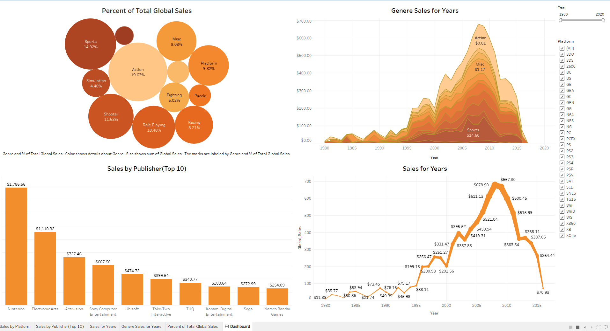

# Video Games Global Sales

## Dashboard Preview

🔗[View Interactive Dashboard on Tableau Public](https://public.tableau.com/views/Video_Games_Global_Sales_17594093239370/Dashboard?:language=en-US&:sid=&:redirect=auth&:display_count=n&:origin=viz_share_link)

### Problem

The video game industry generates billions worldwide, but sales distribution varies by platform, genre, and region.  
The problem is to understand **which factors drive sales** and how they differ across global markets.

### Data

- **Dataset:** Video Games Global Sales
- **Format:** CSV file
- **Content:** Game title, platform, genre, publisher, sales by region (NA, EU, JP, Others), and global sales
- **Size:** ~16,000 records

### Tools

- **Tableau Desktop** → for visualization & dashboard creation
- **Excel / CSV** → raw dataset

### Preparation

- Cleaned missing and inconsistent values
- Standardized platform and genre names
- Removed duplicates and corrected column types

### Analysis

- Comparison of sales across **regions**
- Identification of **top platforms, genres, and publishers**
- Trends of global sales over time

### Results

- Actionable visual insights into global and regional market distribution
- Interactive filters for deeper exploration
- Highlight of key contributors to industry revenue

### Recommendations

- Focus on **best-selling platforms and genres** for future releases
- Tailor publishing strategies by **regional preferences**
- Monitor **emerging genres** for long-term growth opportunities
